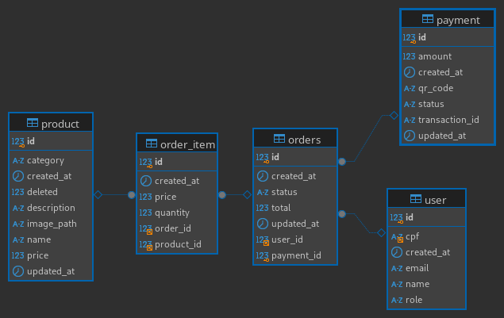

# Totem Express Banco de Dados

---

Esse repositório é referente a parte de Infrastruture As Code para a parte de banco de dados. 
O código da aplicação se encontra [aqui](https://github.com/geggr/software-architecture-fiap) e tem mais descrição da arquitetura e outros repositórios.

---

# Por que da escolha do MySQL

O banco relacional usado por grandes empresas TODO colocar aqui o artigo da uber e facebook(?) e consegue uma boa escala principalmente no transacional. 
Outro fator foi a facilidade de encontrar soluções para problemas na comunidade extensa e que a equipe está bem familiariazada com ele.

Caso no futuro precisarmos também podemos ir para o AWS Aurora que é compativel com ele.  

Decidimos usar no final o AWS RDS MySQL

# Modelagem do banco

Acreditamos que o modelo que temos é o suficiente para suportar as demandas de negócio e os requisitos funcionais.
Um ponto que mudamos da entrega passada foi adicionar um index em `user.cpf` para que o login e pesquisa por cpf para melhorar a desempenho do lambda e autenticação.  